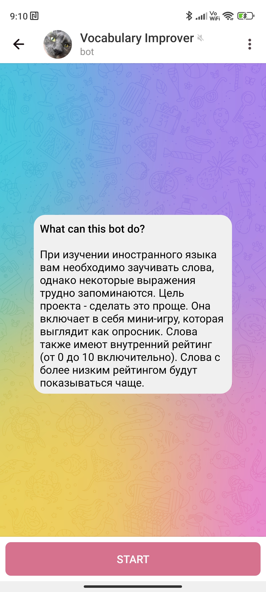
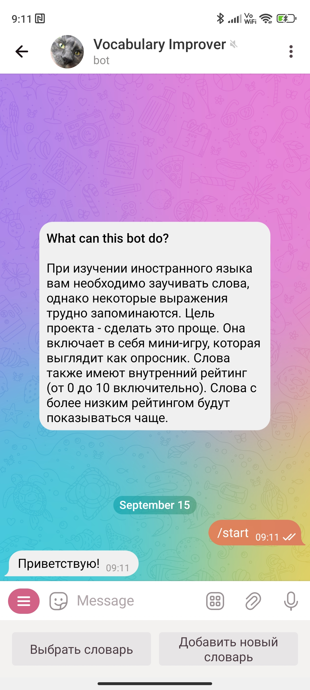
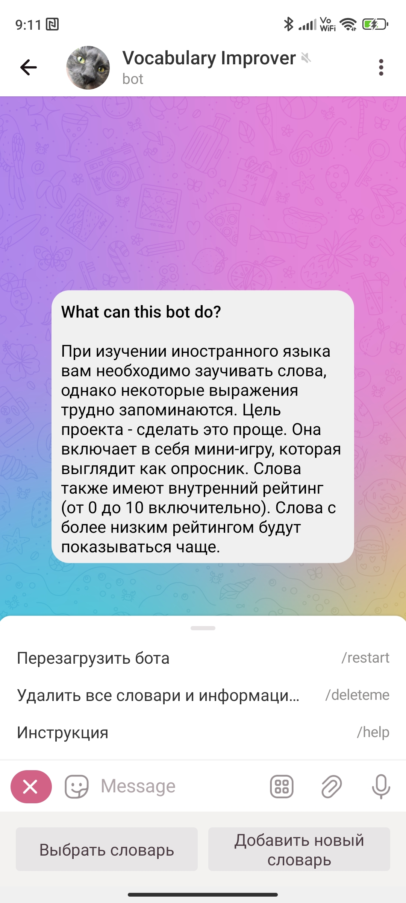
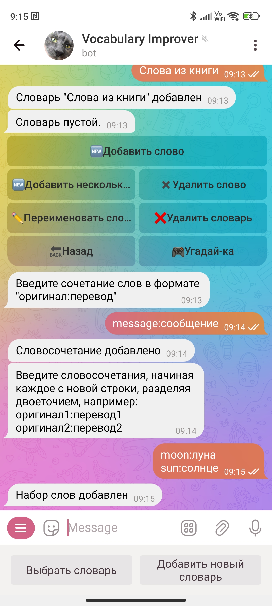
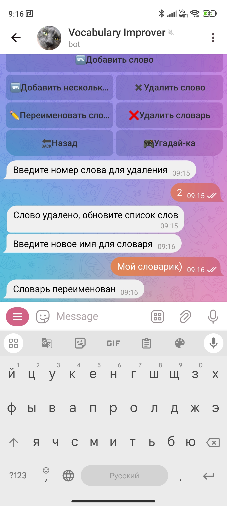
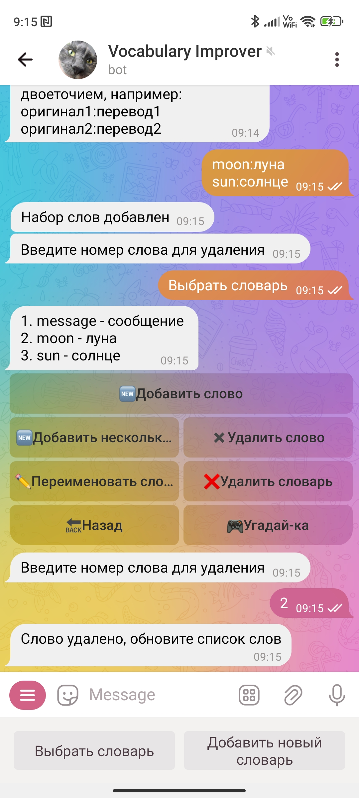
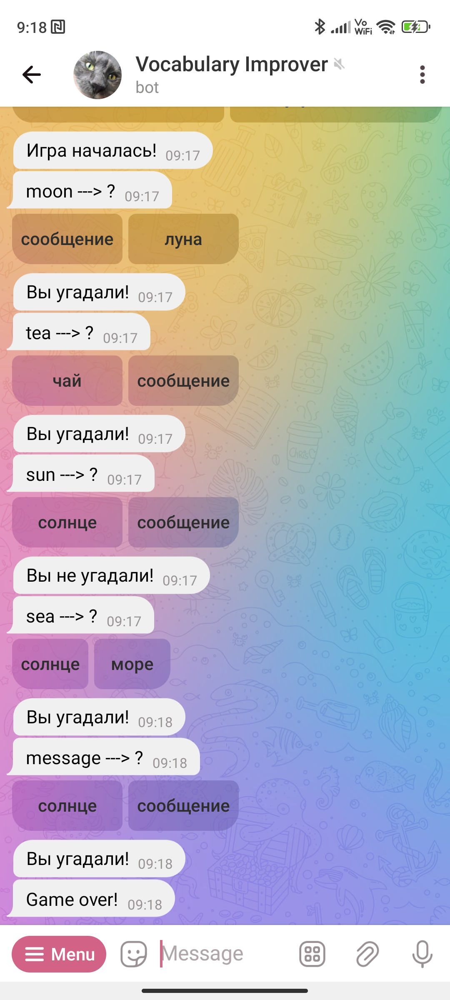

# VocabularyImproverBot  
  
## Начало работы 
  
Начните работу бота, нажав на единственную кнопку снизу:
  

В левой части поля ввода есть кнопка "Меню" с командами. Эти команды позволяют производить действия с ботом, в случае, если он завис или некорректно работает, или вы хотите полностью удалить аккаунт в боте. 

## Работа со словарями

Вам доступа встроенная клавиатура чата внизу чата, на которой представлены всего две кнопки: "Выбрать словарь" и "Добавить словарь". Они доступны в любом состоянии диалога. 

## Меню словаря

Выбрав словарь, вы будете видеть его меню, в котором можно этот словарь переименовать, удалить словарь, сыграть в угадай-ку, добавить слова или удалить.

На примере ниже показано добавление слов по одному и списком, нажатием кнопок меню словаря.

Другие функции из меню словаря:

## Игра "Угадай-ка"

Принцип игры заключается в том, что она выбирает каждое слово из вашего словаря и предлагает угадать его с помощью двух кнопок с переводом. Обязательное требование для начала игры, иметь в словаре **не менее 4 слов**.

